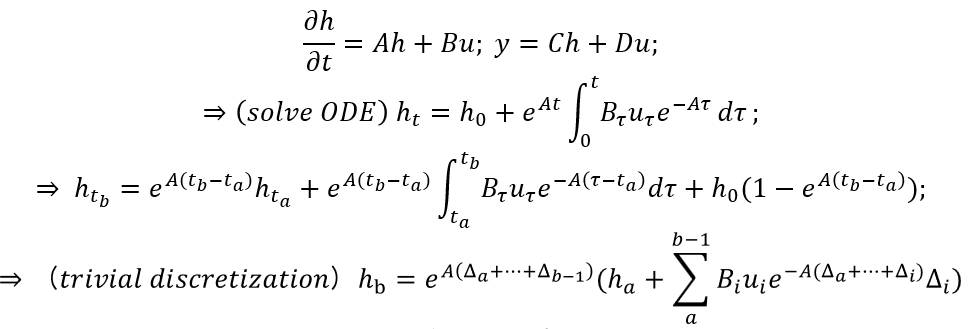

# mamba-mini
an efficient implementation of selective scan in one file, works with both cpu and gpu, with corresponding mathematical derivation. It is probably the code which is the most close to selective_scan_cuda in mamba.

### mathematical derivation


### code
```python
import torch

def selective_scan_easy(us, dts, As, Bs, Cs, Ds, delta_bias=None, chunksize=11111111):
    """
    # B: batch_size, G: groups, D: dim, N: state dim, L: seqlen
    us: B, G * D, L 
    dts: B, G * D, L
    As: G * D, N
    Bs: B, G, N, L
    Cs: B, G, N, L
    Ds: G * D
    delta_bias: G * D
    """
    def selective_scan_chunk(us, dts, As, Bs, Cs, Ds, hprefix=None):
        """
        \partial(h) / \partial(t) = Ah + Bu; y = Ch + Du;
        => \partial(h*exp(-At)) / \partial(t) = Bu*exp(-At);
        => h_t = h_0 + \sum_{0}_{t}_{Bu*exp(A(t-v)) dv};
        => h_b = exp(A(dt_a + ... + dt_{b-1})) * \
                 (h_a + \sum_{a}_{b-1}_{Bu*exp(-A(dt_a + ... + dt_i)) dt_i});
           y_i = C_i*h_i + D*u_i
        """
        """
        us: (L, B, G, D) # L is chunk_size
        dts: (L, B, G, D)
        As: (G, D, N)
        Bs: (L, B, G, N)
        Cs: (L, B, G, N)
        Ds: (G, D)
        hprefix: (1, B, G, D, N)
        """
        ts = dts.cumsum(dim=0)
        Ats = torch.einsum("gdn,lbgd->lbgdn", As, ts)
        hs = torch.einsum("lbgn,lbgd,lbgdn,lbgd->lbgdn", Bs, us, (-Ats).exp(), dts).cumsum(dim=0)
        if hprefix is not None:
            hs = hs + hprefix.unsqueeze(0)
        hs = hs * Ats.exp()
        ys = torch.einsum("lbgn,lbgdn->lbgd", Cs, hs) + torch.einsum("gd,lbgd->lbgd", Ds, us)
        return ys, hs[-1]
    
    if delta_bias is not None:
        dts = dts + delta_bias.view(1, -1, 1)
    
    B, G, N, L = Bs.shape
    us = us.view(B, G, -1, L).permute(3, 0, 1, 2)
    dts = dts.view(B, G, -1, L).permute(3, 0, 1, 2)
    As = As.view(G, -1, N)
    Bs = Bs.permute(3, 0, 1, 2)
    Cs = Cs.permute(3, 0, 1, 2)
    Ds = Ds.view(G, -1)
    
    oys = []
    for i in range(0, L, chunksize):
        ys, hprefix = selective_scan_chunk(
            us[i:i + chunksize], dts[i:i + chunksize], 
            As, Bs[i:i + chunksize], Cs[i:i + chunksize], Ds, hprefix=hprefix, 
        )
        oys.append(ys)

    oys = torch.cat(oys, dim=0).permute(1, 2, 3, 0).view(B, -1, L)
    return oys
```
